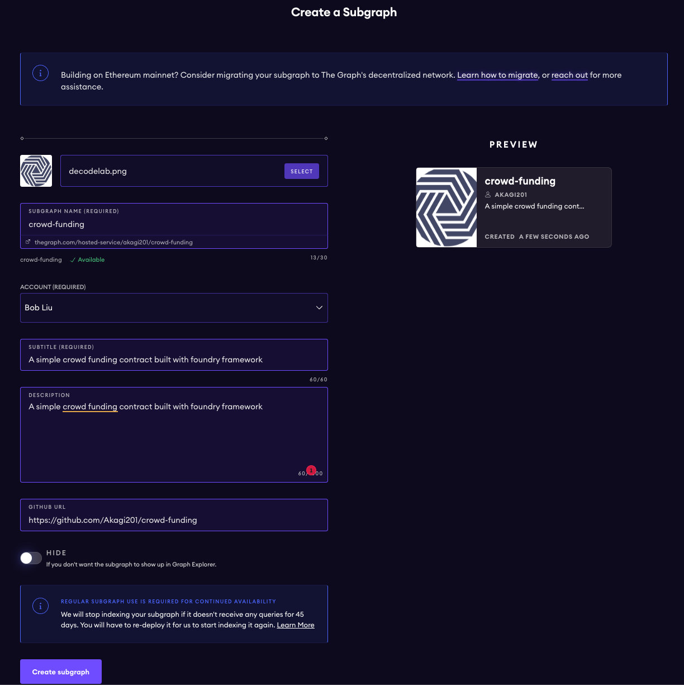

# subgraph

scaffold the subgraph from contract address

```sh
❯ graph init --product hosted-service --from-contract 0xaeb0d5ed71c09a78fde55f822d1ac76929822706
✔ Protocol · ethereum
✔ Subgraph name · Akagi201/crowd-funding
✔ Directory to create the subgraph in · crowd-funding
✔ Ethereum network · sepolia
✔ Contract address · 0xaeb0d5ed71c09a78fde55f822d1ac76929822706
✔ Fetching ABI from Etherscan
✖ Failed to fetch Start Block: Failed to fetch contract creation transaction hash

✔ Start Block · 3280783
✔ Contract Name · CrowdFunding
✔ Index contract events as entities (Y/n) · true
  Generate subgraph
  Write subgraph to directory
✔ Create subgraph scaffold
✔ Initialize networks config
✔ Initialize subgraph repository
✔ Install dependencies with yarn
✔ Generate ABI and schema types with yarn codegen
Add another contract? (y/n):
Subgraph Akagi201/crowd-funding created in crowd-funding

Next steps:

  1. Run `graph auth` to authenticate with your deploy key.

  2. Type `cd crowd-funding` to enter the subgraph.

  3. Run `yarn deploy` to deploy the subgraph.

Make sure to visit the documentation on https://thegraph.com/docs/ for further information.
```

create a hosted service on <https://thegraph.com/hosted-service/dashboard>



codegen

```sh
🕙 15:47:00 ✖  yarn codegen
  Skip migration: Bump mapping apiVersion from 0.0.1 to 0.0.2 (graph-ts dependency not installed yet)
  Skip migration: Bump mapping apiVersion from 0.0.2 to 0.0.3 (graph-ts dependency not installed yet)
  Skip migration: Bump mapping apiVersion from 0.0.3 to 0.0.4 (graph-ts dependency not installed yet)
  Skip migration: Bump mapping apiVersion from 0.0.4 to 0.0.5 (graph-ts dependency not installed yet)
  Skip migration: Bump mapping apiVersion from 0.0.5 to 0.0.6 (graph-ts dependency not installed yet)
  Skip migration: Bump manifest specVersion from 0.0.1 to 0.0.2
  Skip migration: Bump manifest specVersion from 0.0.2 to 0.0.4
✔ Apply migrations
✔ Load subgraph from subgraph.yaml
  Load contract ABI from abis/CrowdFunding.json
✔ Load contract ABIs
  Generate types for contract ABI: CrowdFunding (abis/CrowdFunding.json)
  Write types to generated/CrowdFunding/CrowdFunding.ts
✔ Generate types for contract ABIs
✔ Generate types for data source templates
✔ Load data source template ABIs
✔ Generate types for data source template ABIs
✔ Load GraphQL schema from schema.graphql
  Write types to generated/schema.ts
✔ Generate types for GraphQL schema

Types generated successfully
```

authgraph deploy --product hosted-service akagi201/crowd-funding

```sh
graph auth --product hosted-service xxx
```

deploy

```sh
graph deploy --product hosted-service akagi201/crowd-funding
  Skip migration: Bump mapping apiVersion from 0.0.1 to 0.0.2
  Skip migration: Bump mapping apiVersion from 0.0.2 to 0.0.3
  Skip migration: Bump mapping apiVersion from 0.0.3 to 0.0.4
  Skip migration: Bump mapping apiVersion from 0.0.4 to 0.0.5
  Skip migration: Bump mapping apiVersion from 0.0.5 to 0.0.6
  Skip migration: Bump manifest specVersion from 0.0.1 to 0.0.2
  Skip migration: Bump manifest specVersion from 0.0.2 to 0.0.4
✔ Apply migrations
✔ Load subgraph from subgraph.yaml
  Compile data source: CrowdFunding => build/CrowdFunding/CrowdFunding.wasm
✔ Compile subgraph
  Copy schema file build/schema.graphql
  Write subgraph file build/CrowdFunding/abis/CrowdFunding.json
  Write subgraph manifest build/subgraph.yaml
✔ Write compiled subgraph to build/
  Add file to IPFS build/schema.graphql
                .. QmQXsgujGnA5SWxs768DEzxvCRG2gELsH9tspkq45KzUgK
  Add file to IPFS build/CrowdFunding/abis/CrowdFunding.json
                .. QmZVfXWd8ZN15vzGV5LNn54C92dBqVYCyjyaa3qXTmbbNa
  Add file to IPFS build/CrowdFunding/CrowdFunding.wasm
                .. QmRwuEi6WDah8Ms1UU9nxErBfgB28wU5KzE2vURFNvftPF
✔ Upload subgraph to IPFS

Build completed: QmfWkFuuV6okqSLkRJJiHrioySPUsJFa93pgDGj6dcrDzc

Deployed to https://thegraph.com/explorer/subgraph/akagi201/crowd-funding

Subgraph endpoints:
Queries (HTTP):     https://api.thegraph.com/subgraphs/name/akagi201/crowd-funding
```
